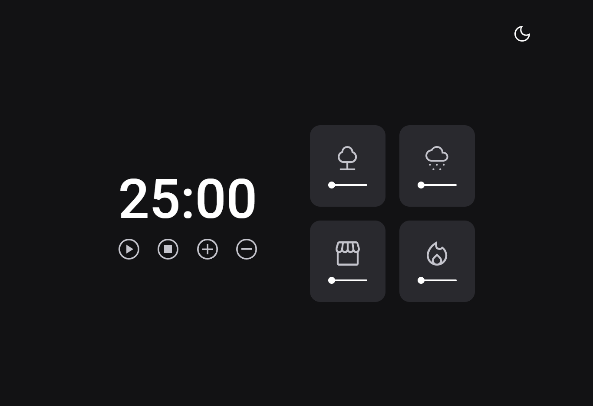

# FocusTimer 2.0

## 💻 Sobre o desafio

Projeto desenvolvido durante o desafio do Stage 5 do Explorer da Rocketseat.

## 🔖 Layout

[🔗 Clique aqui para acessar](https://www.figma.com/file/Pw8yMsK7HFkD6aISZt6gPA/Stage-05---Focus-Timer-2.0/duplicate)

## 🚀 Tecnologias

Esse desafio foi resolvido com as seguintes tecnologias:

- HTML
- CSS
- JS

## 📧 Contato

[vinicius@becaleti.com](mailto:vinicius@becaleti.com)